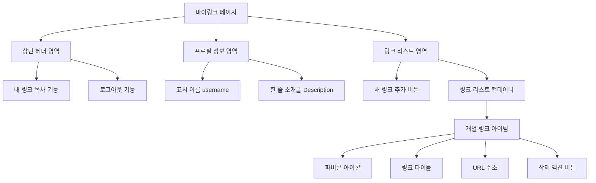

# 마이링크 (MyLink) 와이어프레임 (Wireframe)

## 1. 컴포넌트 구조도 (Mermaid)



## 2. 화면 스케치 (ASCII Art)

### 2.1. 소유자(관리자) 뷰 - 편집 모드
*모바일 사이즈를 기준으로 한 중앙 정렬 1단 레이아웃 (가운데 정렬)*

```text
+------------------------------------------+
|  [🔗 내 링크 복사]             [로그아웃]|
+------------------------------------------+
|                                          |
|                                          |
|            닉네임 (✏️)                    |
|       자신을 묘사하는 한 줄 소개 (✏️)      |
|                                          |
+------------------------------------------+
|                                          |
|  [ + 새로운 링크 추가하기 ]                |
|                                          |
+------------------------------------------+
|  [ 파비콘 ] 내 기술 블로그 (✏️)    [🗑️] |
|             https://my-blog... (✏️)      |
+------------------------------------------+
|  [ 파비콘 ] 깃허브 레포지토리 (✏️) [🗑️] |
|             https://github.com/.. (✏️)   |
+------------------------------------------+
```
**UI/UX 설명:**
- `(✏️)` 표시가 있는 텍스트는 클릭 즉시 수정할 수 있는 **인라인 편집(Inline Editing)** 요소입니다.
- 링크 아이템 삭제 버튼(`🗑️`)은 수정 모드인 소유자에게만 우측 끝에 노출됩니다.

### 2.2. 방문자 뷰 - 퍼블릭 모드
*방문자가 접속했을 때 랜딩되는 실제 서비스 화면 (읽기 전용)*

```text
+------------------------------------------+
|                                          |
|                                          |
|                                          |
|                 닉네임                   |
|         자신을 묘사하는 한 줄 소개         |
|                                          |
|                                          |
+------------------------------------------+
|                                          |
|  [ 파비콘 ] 내 기술 블로그                 |
|                                          |
+------------------------------------------+
|                                          |
|  [ 파비콘 ] 깃허브 레포지토리              |
|                                          |
+------------------------------------------+
|                                          |
|                                          |
|           Powered by MyLink              |
+------------------------------------------+
```
**UI/UX 설명:**
- 버튼 형태로 렌더링되며, 클릭 시 등록된 해당 URL 새 창(또는 현재 창) 띄우기로 이동합니다.
- 복사, 로그아웃, 수정(`✏️`), 삭제(`🗑️`) 인터페이스가 전부 보이지 않습니다.

---
**문서 상태:** 📝 Draft (사용자 확인 및 피드백 대기 중)
